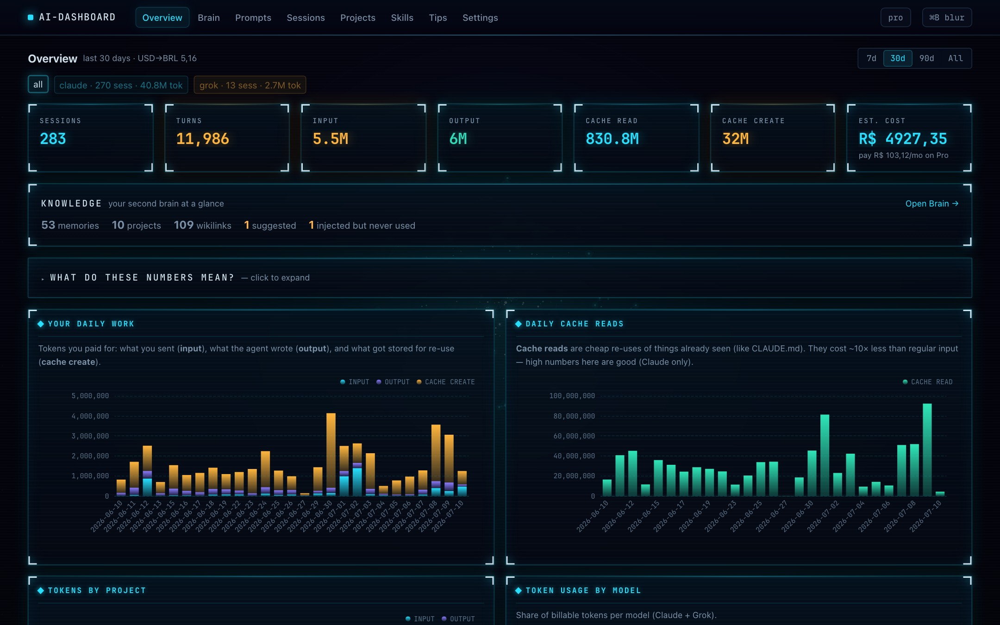
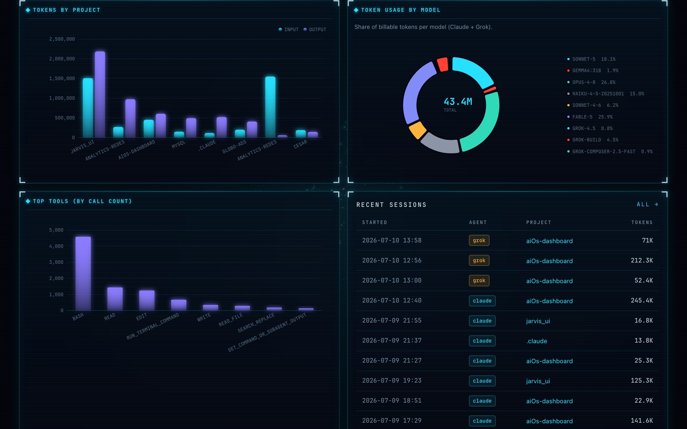
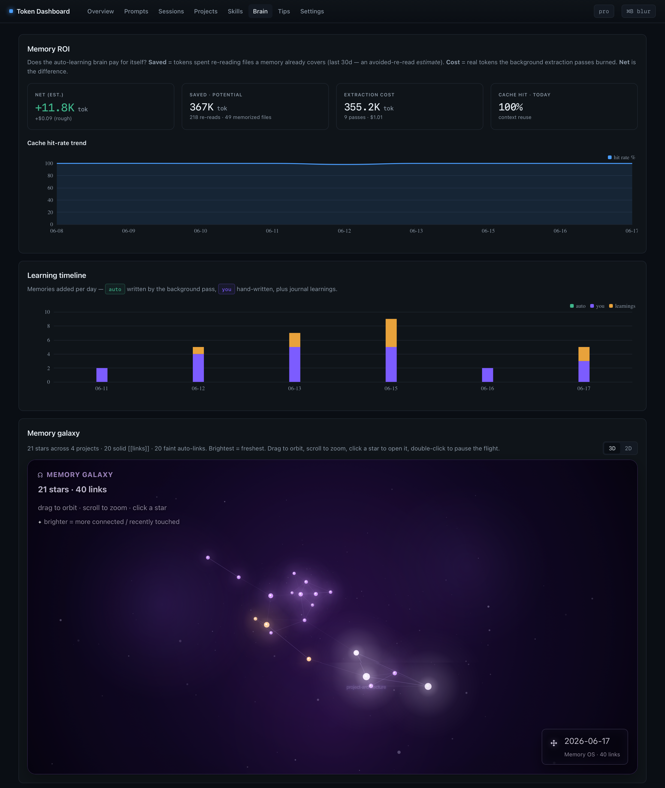
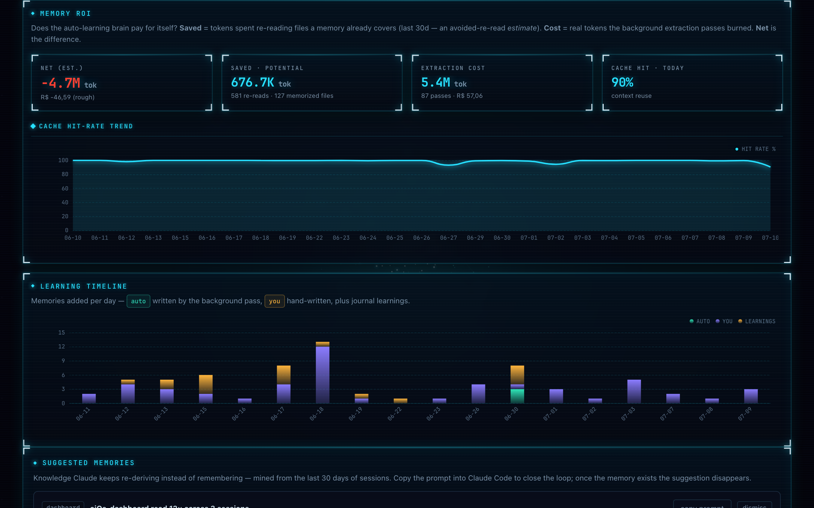

# AI-Dashboard

A local multi-agent dashboard that reads Claude Code JSONL under `~/.claude/projects/` **and** Grok CLI sessions under `~/.grok/sessions/`, then turns them into per-prompt cost analytics (displayed in **R$**), tool/file heatmaps, cache analytics, project comparisons, a rule-based tips engine, and the shared **Second Brain** memory browser.

**Everything runs locally.** No data leaves your machine — no telemetry, no API calls for your data, no login. The default UI is a JARVIS-style HUD rendered with htmx (Python f-strings, no template engine, no build step). The original vanilla SPA still lives at `/spa`.









## What this is useful for

- Seeing which of your prompts are expensive (surprise: they usually involve large tool results).
- Comparing token usage across projects you've worked on.
- Filtering Overview by **time range** (7d / 30d / 90d / all) and by **agent** (`claude` / `grok` / all).
- Spotting wasteful patterns — the same file read twenty times in a session, a tool call returning 80k tokens.
- Understanding what a "cache hit" actually saves you.
- If you're on Pro or Max, confirming you're getting your money's worth in API-equivalent cost (shown in BRL).
- Comparing Claude vs Grok usage side by side (source chips on Overview, badges on sessions).
- Browsing the shared Second Brain graph and checking whether auto-learned memories pay for themselves (ROI).
- Blurring sensitive text for screenshots (`Cmd/Ctrl+B`).

## Prerequisites

- **Python 3.8 or newer** — already installed on macOS and most Linux. On Windows: `winget install Python.Python.3.12` or download from python.org.
- **Claude Code** and/or **Grok CLI** — installed with at least one session run. The dashboard reads those sessions. If you just installed an agent and haven't used it yet, run at least one prompt first.
- **A web browser.** Any modern one.

No `pip install`. No Node.js. No build step.

## Quickstart

```bash
git clone https://github.com/CesarGuilherme/aiOs-dashboard.git
cd aiOs-dashboard
python3 cli.py dashboard
```

## Docker

If you prefer not to run Python directly, a Dockerfile and Compose file are included.

### Build and run with Docker Compose (recommended)

```bash
git clone https://github.com/CesarGuilherme/aiOs-dashboard.git
cd aiOs-dashboard
docker compose up --build
```

This mounts `~/.claude` and `~/.grok` into the container so the dashboard reads both agents’ sessions. Compose pins `TOKEN_DASHBOARD_DB` to `/data/claude/token-dashboard.db` (host path `~/.claude/token-dashboard.db`) so the cache lives on the mounted volume — that is a Docker exception; a native run defaults to `~/.brain/token-dashboard.db`. It also live-mounts `web/` so frontend edits appear on browser refresh without a rebuild. Open http://localhost:8181 once the container starts.

Compose does **not** mount `~/.brain`, so the Brain tab (memories under `~/.brain/projects/` + `~/.brain/global/`) and the FX file `~/.brain/.usd_brl` are empty/default inside the container unless you add that volume.

### Run with plain Docker

```bash
docker build -t aios-dashboard .
docker run -p 8181:8181 \
  -v ~/.claude:/data/claude \
  -e HOST=0.0.0.0 \
  -e CLAUDE_PROJECTS_DIR=/data/claude/projects \
  -e TOKEN_DASHBOARD_DB=/data/claude/token-dashboard.db \
  aios-dashboard
```

Optional Grok mount on plain Docker:

```bash
docker run -p 8181:8181 \
  -v ~/.claude:/data/claude \
  -v ~/.grok:/data/grok \
  -e HOST=0.0.0.0 \
  -e CLAUDE_PROJECTS_DIR=/data/claude/projects \
  -e GROK_SESSIONS_DIR=/data/grok/sessions \
  -e TOKEN_DASHBOARD_DB=/data/claude/token-dashboard.db \
  aios-dashboard
```

> **Note:** `HOST=0.0.0.0` is required so the server is reachable outside the container. Port 8181 is still bound to localhost only via `-p 8181:8181`, so nothing is exposed to the network. After a `git pull` that adds new files to `web/`, the live mount picks them up immediately — no rebuild needed. Rebuilding is only required for Python (`token_dashboard/`) changes.

> On Windows, if `python3` isn't on your PATH, substitute `py -3` for `python3` in every command below.

The command:
1. Scans `~/.claude/projects/` and `~/.grok/sessions/` (first run can take 20–60 seconds on a heavy user's machine).
2. Starts a local server at http://127.0.0.1:8181.
3. Opens your default browser to that URL.

Leave it running; it re-scans every 30 seconds and pushes a `scan` event over SSE. The default htmx UI re-fetches the current tab (Brain is skipped so the canvas doesn't reset). The SPA at `/spa` patches Overview in place and leaves other tabs put. Stop with `Ctrl+C`.

## Where the data comes from

Claude Code writes one JSONL file per session here:

| OS | Path |
|---|---|
| macOS / Linux | `~/.claude/projects/<project-slug>/<session-id>.jsonl` |
| Windows | `C:\Users\<you>\.claude\projects\<project-slug>\<session-id>.jsonl` |

Grok CLI sessions live under `~/.grok/sessions/` (`updates.jsonl` + `summary.json` per session).

The dashboard never modifies those session files — it only reads them and keeps a local SQLite cache at `~/.brain/token-dashboard.db` (override with `--db` or `TOKEN_DASHBOARD_DB`).

To point at a different location:

```bash
python3 cli.py dashboard --projects-dir /path/to/projects --db /path/to/cache.db
```

### Environment variables

| Var | Default | Purpose |
|---|---|---|
| `PORT` | `8181` | Port the local web server listens on |
| `HOST` | `127.0.0.1` | Bind address. Keep the default. Setting `0.0.0.0` exposes your entire prompt history to anyone on your local network — don't do this on any network you don't fully control (no coffee-shop Wi-Fi, no coworking spaces). |
| `CLAUDE_PROJECTS_DIR` | `~/.claude/projects` | Claude Code session JSONL root |
| `GROK_SESSIONS_DIR` | `~/.grok/sessions` | Grok CLI sessions root (`updates.jsonl` per session) |
| `TOKEN_DASHBOARD_DB` | `~/.brain/token-dashboard.db` | SQLite cache location |
| `USD_BRL` | (file / 5.40) | Override USD→BRL rate; default reads `~/.brain/.usd_brl` |

Pricing lives in [`pricing.json`](pricing.json) (USD per 1M tokens). The UI converts to **R$** via the statusline rate file. Shared durable memory (Second Brain) lives under `~/.brain/projects/` + `~/.brain/global/` for every agent.

CSV exports (stdlib, no extra deps): `GET /api/prompts.csv` and `GET /api/projects.csv`.

## CLI reference

```bash
python3 cli.py scan          # populate / refresh the local DB, then exit
python3 cli.py today         # today's totals (terminal)
python3 cli.py stats         # all-time totals (terminal)
python3 cli.py tips          # active suggestions (terminal)
python3 cli.py dashboard     # scan + serve the UI at http://localhost:8181

# dashboard flags
python3 cli.py dashboard --no-open   # don't auto-open the browser
python3 cli.py dashboard --no-scan   # skip the initial scan (use cached DB only)
```

Change the port: `PORT=9000 python3 cli.py dashboard`.

## The 8 tabs

The default UI uses real URLs under `/hx/…` (bookmarkable; Overview is `/` and `/hx`). The SPA at `/spa` uses a hash-router (`#/prompts`). JSON APIs under `/api/` still back the SPA and CSV exports.

- **Overview** — input/output/cache tokens, sessions, turns, estimated cost on your chosen plan (R$), daily work and cache-read charts, tokens-by-project, token share by model, top tools by call count, and recent sessions. Filter with range tabs (`7d` / `30d` / `90d` / `all`) and source chips (`all` / `claude` / `grok`). Landing tab; also shows a Second Brain knowledge strip and a "What do these numbers mean?" panel. On the SPA, live SSE updates patch this tab in place; on htmx they re-fetch the tab.
- **Brain** — your persistent memory across agents. Interactive **Second brain** synapse graph (`web/rings.js`): every memory node, color by project/group, linked via `[[wikilinks]]`. Shift+drag orbits, plain drag pans, scroll zooms; `/` focuses search; click a node for Fly-to / detail. Sidebar lists Skills, Routines, and Applications from `/api/workspace`. Below the graph: Memory ROI (saved vs extraction cost), cache hit-rate trend, learning timeline, auto-generated suggestions, effectiveness/prune candidates, and per-project memory browsers. SSE soft-refresh skips this tab so the canvas doesn't reset mid-view.
- **Prompts** — your most expensive user prompts ranked by tokens. Click any row to see the assistant response, tool calls made, and the size of each tool result.
- **Sessions** — turn-by-turn view of any single session, with per-turn tokens and tool calls (source badge for Claude vs Grok).
- **Projects** — per-project comparison: tokens, session counts, and which files were touched most.
- **Skills** — which skills you invoke most often, and (where we can measure them) their token cost. See [limitations](docs/KNOWN_LIMITATIONS.md#skills-token-counts-are-partial).
- **Tips** — rule-based suggestions for reducing token usage (repeated file reads, oversized tool results, low cache-hit rate, etc.).
- **Settings** — switch pricing between API / Pro / Max / Max-20x so cost figures everywhere else reflect your actual plan. Reminder: `Cmd/Ctrl+B` blurs sensitive text for screenshots.

## Two frontends

The dashboard ships **two complete UIs over the same data**, in the same process:

| | htmx (default) | vanilla SPA |
|---|---|---|
| URL | `http://127.0.0.1:8181/` | `http://127.0.0.1:8181/spa` |
| Rendering | Python f-strings, HTML over the wire | vanilla JS, `fetch` + template literals |
| Routing | real URLs (`/hx/prompts?sort=recent`) | hash router (`#/prompts?sort=recent`) |

Same eight tabs, same JARVIS theme (`web/style.css` is shared byte-for-byte). The topbar has an `spa` pill to jump to the old UI. Charts and the Brain graph stay JS islands in both — `web/charts.js` and `web/rings.js` are reused unmodified.

`web/htmx.min.js` is vendored (48 KB), like `web/echarts.min.js` — still no `pip install`, still no runtime network calls. To refresh it:

```bash
curl -L https://unpkg.com/htmx.org@2.0.4/dist/htmx.min.js -o web/htmx.min.js
```

To make the SPA the default again, swap the two branches at the top of `do_GET` in `token_dashboard/server.py` — `/` serves `web/index.html`, `/hx` serves the htmx shell.

## Why not Obsidian + Graphify?

The AI tools community often promotes Obsidian with the Graphify plugin as the go-to external memory system for AI workflows. We evaluated it and chose differently — here's why.

**The problems with Obsidian + Graphify:**
- Requires a separate app, sync setup, and plugin maintenance running alongside Claude Code
- Claude cannot natively read an Obsidian vault during a session without extra plumbing
- Graphify's visual graph is visually appealing but provides little practical benefit for how Claude actually retrieves and uses context
- It's promoted by AI influencers for its aesthetics, not because it makes the AI meaningfully more effective

**Why plain markdown files work better:**
- Agents read `.md` files directly — no middleware, no plugins, no extra tools
- Durable memory is vendor-neutral under `~/.brain/projects/` + `~/.brain/global/`
- Structured frontmatter (`name`, `description`, `type`) gives agents fast, reliable context loading at the start of every session
- Files are human-readable, git-friendly, and auditable without any tooling
- The Brain tab adds ROI tracking, suggested memories, and a live Second brain graph on top — things Obsidian has no concept of

If you already use Obsidian, you can open `~/.brain/` as a vault to get a rich editor for your memory files — `[[wikilinks]]` are parsed as soft-links in the Second brain graph. But it's never required.

## Troubleshooting

**"No data" or empty charts.** Run `python3 cli.py scan` once to populate the DB, then reload.

**Port 8181 already in use.** `PORT=9000 python3 cli.py dashboard`.

**Numbers look wrong / stuck.** The DB lives at `~/.brain/token-dashboard.db` (Docker Compose: `~/.claude/token-dashboard.db`). Delete it and re-run `python3 cli.py scan` to rebuild from scratch.

**Running the dashboard twice at the same time.** Don't — both processes will fight over the SQLite DB. Stop all instances before starting a new one.

**Grok rows missing in Docker.** `docker-compose.yml` mounts `~/.grok` and sets `GROK_SESSIONS_DIR`. On a plain `docker run`, add `-v ~/.grok:/data/grok` and `-e GROK_SESSIONS_DIR=/data/grok/sessions`.

## Accuracy note

Claude Code writes each assistant response 2–3 times to disk while it streams (the same API message gets snapshotted as output grows). The dashboard dedupes these by `message.id` so the final tally matches what the API actually billed. If you compare against another tool that sums every JSONL row, expect this dashboard's numbers to be lower — and closer to reality.

Grok uses billed `turn_completed.usage` when present; older turns still reconstruct from context growth and message length (see [KNOWN_LIMITATIONS](docs/KNOWN_LIMITATIONS.md#grok-tokens-real-usage-when-present-estimate-otherwise)).

## Privacy

Nothing leaves your machine. No telemetry. No remote calls for your data. The browser talks only to `127.0.0.1` (htmx HTML and `/api/*` JSON), and all JS/CSS/fonts are served from that same local server — ECharts and htmx are vendored into `web/`, and the UI falls back to system fonts rather than pulling from a font CDN. If you want to verify: `grep -r "https://" token_dashboard/ web/ --exclude='echarts.min.js'` — you'll find nothing user-data related.

## Tech stack

Python 3 (stdlib only) for the CLI, scanners, HTTP server, and the default htmx UI (`hx_views.py` / `hx_tabs.py` / `hx_overview.py` / `hx_brain.py`). SQLite for the local cache. Charts are ECharts islands; the Brain graph is hand-rolled `rings.js` canvas; HUD background lattice — no build step. Dark JARVIS theme. Live updates over SSE: htmx re-fetches the current tab; the SPA at `/spa` patches Overview in place (full remount only on navigation).

Data flow: `cli.py` → `scan_all` → Claude `scanner.py` + Grok `grok_scanner.py` → SQLite; `token_dashboard/server.py` exposes `/api/*` JSON routes (including `/api/brain`, `/api/workspace`, `/api/stream`), `/hx/*` HTML, and serves `web/`.

## Further reading

- [`CLAUDE.md`](CLAUDE.md) — conventions and architecture overview (also picked up automatically by Claude Code)
- [`CONTRIBUTING.md`](CONTRIBUTING.md) — how to develop and test
- [`docs/KNOWN_LIMITATIONS.md`](docs/KNOWN_LIMITATIONS.md) — rough edges
- [`docs/inspiration.md`](docs/inspiration.md) — prior art and how this project diverges

## Contributing

See [`CONTRIBUTING.md`](CONTRIBUTING.md). Short version: fork, `python3 -m unittest discover tests` before opening a PR, keep it stdlib-only.

## License

[MIT](LICENSE).
